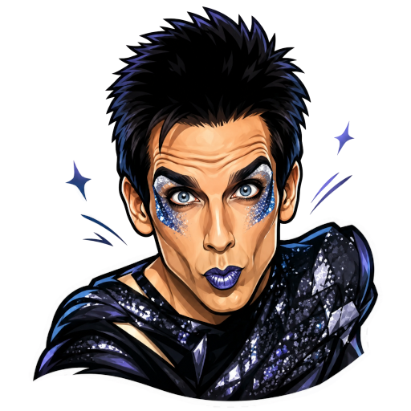

<div align="center">
  
  <h1>Blue Steel</h1>
  <p><strong>Vision browser agent</strong> powered by Camoufox stealth Firefox</p>
  <p>
    <a href="LICENSE"></a>
    <a href="https://github.com/Apothic-AI/blue-steel"></a>
  </p>
</div>

---

Blue Steel controls a real browser with natural language. A vision model looks at screenshots, plans pixel-accurate actions, and executes them through **Camoufox** (fingerprint-resistant Firefox) instead of stock Chromium/Playwright.

Built for automations that need to look human: multi-account containers, per-container proxies, and Cloudflare Turnstile solving—without giving up a clean agent API.

```ts
import { startBrowserAgent } from 'blue-steel-core';
import { z } from 'zod';

const agent = await startBrowserAgent({
  url: 'https://example.com',
  browser: { profileName: 'blue-steel' },
  narrate: true,
});

await agent.act('Open the more information link');

const data = await agent.extract(
  'Summarize the main heading and first paragraph',
  z.object({
    heading: z.string(),
    paragraph: z.string(),
  }),
);

console.log(data);
await agent.stop();
```

## Why Blue Steel?

| | |
|---|---|
| **Vision-first** | Actions are grounded in screenshots and coordinates—not brittle CSS selectors |
| **Camoufox runtime** | Stealth Firefox via Selenium; dedicated agent skill, not a Chromium CDP toy |
| **Containers & proxies** | Firefox Multi-Account Containers + Container Proxy, opt-in per account |
| **Cloudflare aware** | Closed-shadow Turnstile path exposed as `browser:cf:solve` |
| **Familiar agent API** | `startBrowserAgent` → `act` / `extract` / `nav` (Magnitude-shaped) |

Heritage: architecture and agent loop descend from [Magnitude](https://github.com/magnitudedev/magnitude) (Apache-2.0). The browser backend is Blue Steel’s Camoufox skill—**the upstream `cloverlabs-camoufox` skill is never modified.**

## Repository layout

| Path | Role |
|------|------|
| [`packages/blue-steel-core`](packages/blue-steel-core) | Agent, Camoufox client, harness, actions |
| [`packages/blue-steel-extract`](packages/blue-steel-extract) | HTML → structured markdown for extract |
| [`packages/blue-steel-test`](packages/blue-steel-test) | Test runner (`.bs.ts` cases) |
| [`packages/blue-steel-mcp`](packages/blue-steel-mcp) | MCP server over the Camoufox harness |
| [`packages/create-blue-steel-app`](packages/create-blue-steel-app) | Project scaffold |
| [`skill/`](skill) | Camoufox controller + JSON-lines protocol |

## Requirements

- **Node** ≥ 18 (Bun recommended for the monorepo)
- **uv** + Python 3.13 (skill bootstrap)
- **Linux** with a display for headed mode, or use headless
- A **visually grounded** LLM (e.g. Claude Sonnet / compatible vision model)

## Quick start

### 1. Clone and install

```bash
git clone https://github.com/Apothic-AI/blue-steel.git
cd blue-steel
bun install
```

### 2. Bootstrap the Camoufox skill

Downloads Camoufox, Selenium stack, and Container Proxy; installs the skill for local agents:

```bash
bun run bootstrap-skill
# equivalent:
#   bash skill/scripts/bootstrap.sh
#   rsync -a --exclude .venv skill/ ~/.agents/skills/blue-steel/
```

### 3. Build packages

```bash
bun run build
```

### 4. Configure a model

```bash
export ANTHROPIC_API_KEY=sk-ant-...
# or other providers supported by the agent harness — see packages/blue-steel-core
```

### 5. Smoke-test the browser (no LLM)

```bash
bun run smoke
# or headed:
#   bun packages/blue-steel-core/examples/camoufox_smoke.ts
```

### 6. Run an agent

```bash
cd packages/blue-steel-core
bun examples/camoufox_smoke.ts   # browser only
# then wire startBrowserAgent with your key — see skill/SKILL.md
```

## Architecture

```text
┌─────────────────────┐
│  Vision LLM (BAML)  │
└──────────┬──────────┘
           │ screenshots + coordinate actions
┌──────────▼──────────┐
│  blue-steel-core    │  WebHarness · webActions
│  CamoufoxClient     │  JSON-lines over stdin/stdout
└──────────┬──────────┘
           │
┌──────────▼──────────┐
│  skill controller   │  interactive_camoufox.py
│  Selenium + Gecko   │  containers · proxy · CF
└──────────┬──────────┘
           │
┌──────────▼──────────┐
│  Camoufox Firefox   │  ~/.camoufox/profiles/blue-steel
└─────────────────────┘
```

Default profile: `~/.camoufox/profiles/blue-steel` (isolated from other Camoufox skills).

## Environment variables

| Variable | Purpose |
|----------|---------|
| `BLUE_STEEL_SKILL_DIR` | Override skill root (default: `./skill` or `~/.agents/skills/blue-steel`) |
| `BLUE_STEEL_PYTHON` | Python binary with Camoufox deps |
| `BLUE_STEEL_PROFILE_NAME` | Firefox profile name (default `blue-steel`) |
| `BLUE_STEEL_HEADLESS` | `1` for headless smoke/CI |
| `BLUE_STEEL_NARRATE` | Log agent actions to the console |
| `ANTHROPIC_API_KEY` / etc. | LLM credentials |

## Skill protocol (highlights)

The controller speaks JSON lines. Blue Steel adds coordinate I/O on top of selector ops:

```json
{"op":"navigate","url":"https://example.com"}
{"op":"screenshot","encoding":"base64"}
{"op":"mouse_click","x":120,"y":340,"button":"left","count":1}
{"op":"keys_type","text":"hello","delay_ms":20}
{"op":"cf_solve","timeout":30}
{"op":"quit"}
```

Full reference: [`skill/SKILL.md`](skill/SKILL.md).

## Scripts

| Command | Description |
|---------|-------------|
| `bun run bootstrap-skill` | Install Camoufox runtime + sync agent skill |
| `bun run build` | Build workspace packages |
| `bun run test` | Protocol unit test (fake controller) |
| `bun run smoke` | Headless live browser smoke test |
| `bun run check` | Typecheck core |

## MCP

```bash
# after build — stdio MCP server
node packages/blue-steel-mcp/dist/index.js
```

Tools: `open_browser`, `act`, `screenshot`, `cf_solve`. Configure your MCP host to run that binary with `BLUE_STEEL_SKILL_DIR` set if needed.

## License

**Apache License 2.0** — see [`LICENSE`](LICENSE) and [`NOTICE`](NOTICE).

Copyright 2026 Apothic AI and Blue Steel contributors.

Portions derived from Magnitude (Apache-2.0). Camoufox skill patterns are maintained as a separate Blue Steel skill copy; upstream `cloverlabs-camoufox` is not modified by this project.
